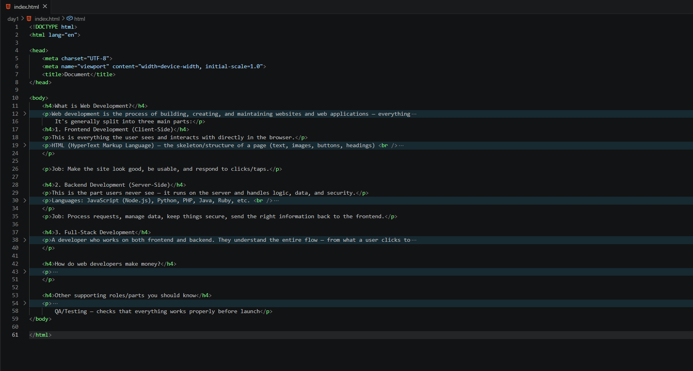

HTML Revision — Web Development Journey

Documenting my day-by-day journey learning web development, 
starting with HTML fundamentals and building toward full-stack skills.

Progress Log

| Day | Topic | Link |
|-----|-------|------|
| 1 | What is Web Development? | [Day 1](./day1) |

Topics Covered So Far
- Web development overview (frontend, backend, full-stack)

<h2>Preview</h2>

  

  

  

Follow the Journey
- Instagram: [@heyitssobya , @thebugmaker]
- LinkedIn: [www.linkedin.com/in/syeda-sobya-72a634374]
- YouTube: [your channel]

> "Small progress every day leads to big success."

